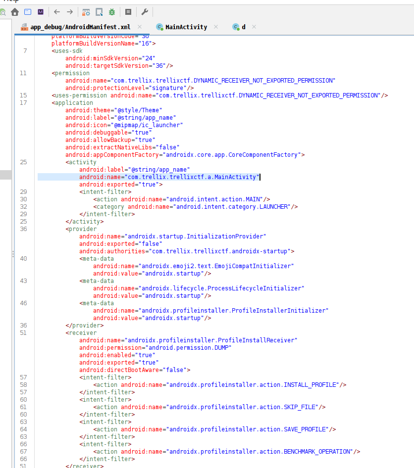
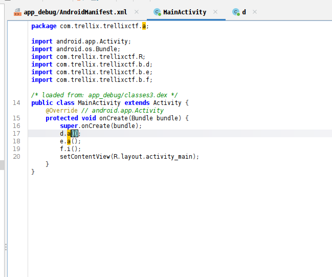
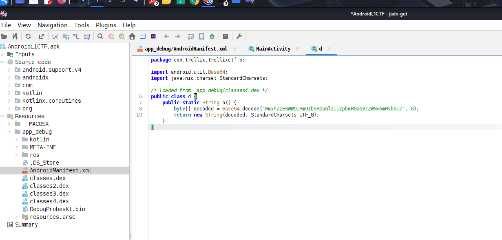
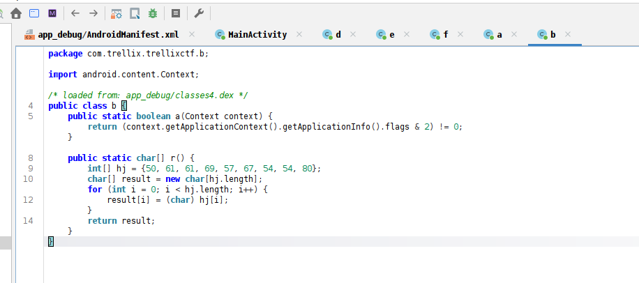
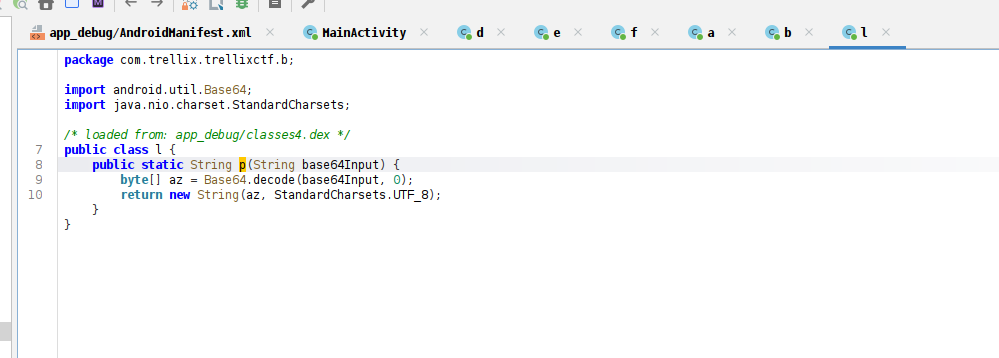
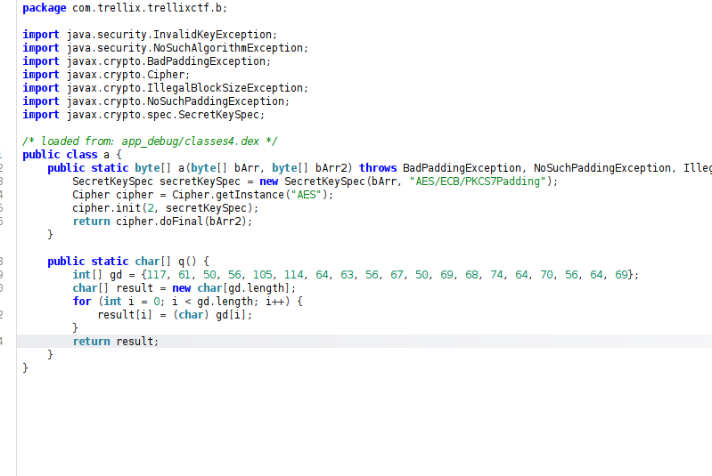

## Solution
- Open the given APK in JADX. 
- Analyze the AndroidManifest.xml file to identify the main activity. 
- This will show the entry point of the app. 
- In the screenshot below, we can see the a.MainActivity class set as the 
launcher.


-  If we navigate to the MainActivity class, we can see three major obfuscated 
functions being called inside the `onCreate()` method

## CTF: TASK 1 



- If we navigate to the `a()` function within class d in JADX, we can see that a string is being decoded using Base64


- String is: `RmxhZzE6WW91Rm91bmR0aGlzIUZpbmR0aGVzZWNvbmRvbmU/`
- If we directly decode the Base64 string, we will obtain the first flag.
- Flag: `Flag1:YouFoundthis!Findthesecondone? `

## CTF: TASK 2

- The second `a()` function in class e internally calls two functions: `g()` (in class f) and `p()` (in class l)

- The first function `g()` takes a parameter (as highlighted in the above screenshot) and returns a Base64-decoded string
- The returned string from step 2 is then passed into the `p()` function, which again performs Base64 decoding

- Basically, two rounds of Base64 decoding are happening here
- The resulting flag is: `Flag2: Yougothis!Findthelastone?`

## CTF Task-3 

- If you navigate to the `i()` function, you will notice that two strings, `a` and `b`, are generated from the functions `q()` and `r()`. These strings are then further processed to produce a decoded string, as shown in line 27
 
- The function definitions of `a()` and `q()` are given below


- Directly convert the above functions into a Java program to retrieve the third flag, as shown in the code snippet below
```
import java.util.Base64;

public class test {

    public static char[] getA() {
        int[] asciiCodes = {117, 61, 50, 56, 105, 114, 64, 63, 56, 67, 50, 69, 68, 74, 64, 70, 56, 64, 69};
        char[] result = new char[asciiCodes.length];
        for (int i = 0; i < asciiCodes.length; i++) {
            result[i] = (char) asciiCodes[i];
        }
        return result;
    }

    public static char[] getB() {
        int[] asciiCodes = {50, 61, 61, 69, 57, 67, 54, 54, 80};
        char[] result = new char[asciiCodes.length];
        for (int i = 0; i < asciiCodes.length; i++) {
            result[i] = (char) asciiCodes[i];
        }
        return result;
    }

    // ROT47 logic (same as your i() method)
    public static String rot47(String input) {
        StringBuilder decoded = new StringBuilder();
        for (int j = 0; j < input.length(); j++) {
            char c = input.charAt(j);
            if (c >= '!' && c <= '~') {
                c = (char) ((((c - '!') + 47) % 94) + 33);
            }
            decoded.append(c);
        }
        return decoded.toString();
    }

    // Equivalent to your i() method


    public static void main(String[] args) {
        char[] a = getA();
        char[] b = getB();

        StringBuilder encoded = new StringBuilder();
        for (char c : a) encoded.append(c);
        for (char c : b) encoded.append(c);

        //return rot47(encoded.toString());
        // Step 2: Apply your i() method logic
        String finalOutput = rot47(encoded.toString());

        // Step 3: Print the result
        System.out.println("Decoded output: " + finalOutput);
    }
}
```
Flag: `Flag:Congratsyougotallthree!`

 